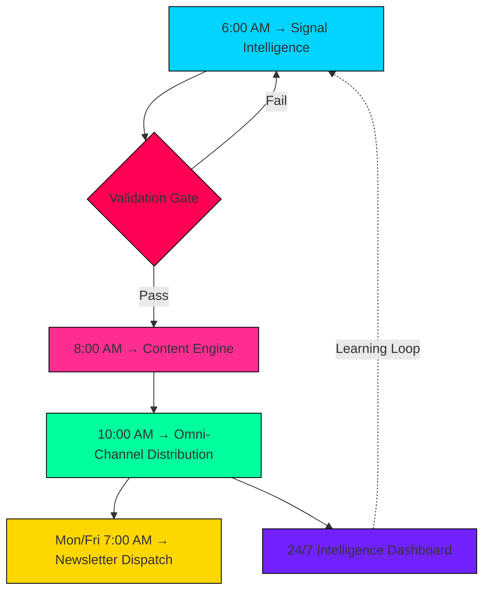

# WenceStudio AI Intelligence Engine

**Daily Workflow Schedule — Locked & Loaded**  
Autonomous multi-agent architecture · Self-monitoring · Self-correcting

---

## Operating Principle

You no longer operate the machine.  
You architect the machine.

The system continuously discovers opportunities, generates intelligence, distributes content, and measures outcomes while you focus on higher-order decisions.

---

## Daily Pipeline

| Time | Stage | Stack |
|------|-------|-------|
| **06:00** | Signal Collection & Analysis | Make.com + ChatGPT-5.5 + Airtable |
| **08:00** | Content Generation | ChatGPT-5.5 Thinking + Claude Sonnet 5 + Knowledge Layer |
| **10:00** | Auto-Distribution | Webflow CMS + Make.com + Buffer |
| **Mon/Fri 07:00** | Newsletter Dispatch | Kit + AI Segmentation |
| **24/7** | Intelligence Dashboard | Airtable + Looker Studio |

---

## 06:00 — Signal Collection & Analysis

**Sources (parallel)**
- Reddit: r/MachineLearning, r/singularity, r/AI, r/LocalLLaMA, r/Automation
- X: #AgenticAI #AIOS #MCP #ComputerUse #VoiceAI #Automation
- Google Trends: AI agents, ChatGPT-5.5, Gemini 3 Pro, Claude Sonnet 5, workflow automation
- Product Hunt: AI + productivity (growth-velocity weighted)
- Hacker News: AI, infrastructure, Show HN
- GitHub Trending: Python, TypeScript, AI frameworks, agent infrastructure

**Thresholds**
- >300% engagement acceleration over 24h
- Multi-source validation required
- Novelty score above historical baseline

**Output** → Airtable / Notion base `Momentum Intelligence 2026`  
5–8 validated opportunities daily  
Fields: `signal_id`, `category`, `momentum_score` (0–100), `primary_source`, `sentiment`, `opportunity_rating`

---

## 08:00 — Content Generation

Sequential agent workflow:

1. **Opportunity Analysis** — Commercial application + B2B / creator / operator relevance
2. **Context Layer** — Query WenceStudio knowledge base + enforce positioning
3. **Long-Form Draft** — 1,200-word intelligence brief (Luxury Intelligence tone)
4. **Visual Asset Generation** — 16:9 cover · 4:5 LinkedIn · 1:1 Instagram
5. **Distribution Package** — SEO title, meta, LinkedIn post, X thread, newsletter summary, carousel JSON

**Reliability**
- Automated retry orchestration
- Model fallback routing
- Average full asset bundle: <4 minutes

---

## 10:00 — Auto-Distribution

**Trigger:** Status = Approved

**Actions**
- Create & publish Webflow CMS entry
- Inject structured data markup
- Generate alt text + optimize media

**Social Cascade**
- X thread
- LinkedIn carousel
- Newsletter queue update
- Community channel notification

---

## Mon & Fri 07:00 — Newsletter Dispatch

**Template:** *The WenceStudio Protocol*

| Section | Content |
|---------|---------|
| The Signal | Most important development of the week |
| The Noise | Low-value trend to ignore |
| The Asset | One prompt / framework / workflow |
| The Opportunity | Revenue or efficiency application |
| The Offer | Dynamic recommendation by subscriber profile |

Audience segmented automatically with behavior-driven personalization.

---

## 24/7 Intelligence Dashboard

Live visibility:
- Signals processed
- Opportunities approved
- Content published
- Audience growth
- Revenue attribution
- Conversion performance
- Search visibility
- Automation health score

Learning loop feeds continuously back into the 06:00 signal layer.

---

## Current System State

| Stage | Status |
|-------|--------|
| Signal Intelligence | COMPLETE |
| Opportunity Validation | COMPLETE |
| Content Generation | COMPLETE |
| Distribution Queue | SCHEDULED |
| Newsletter Pipeline | ACTIVE |

---

## Linked Resources

- **Notion Command Center**: [WenceStudio AI Intelligence Engine](https://app.notion.com/p/3ae60f582a8d817f9e2bde0d7b21cf46)
- **Momentum Intelligence Database**: [Momentum Intelligence 2026](https://www.notion.so/69063ed8e4ad4530b1d08253a2a772e4)

---

*Welcome to the next generation of AI-native brand operations.*  
*Now build something remarkable with the time you reclaimed.*
